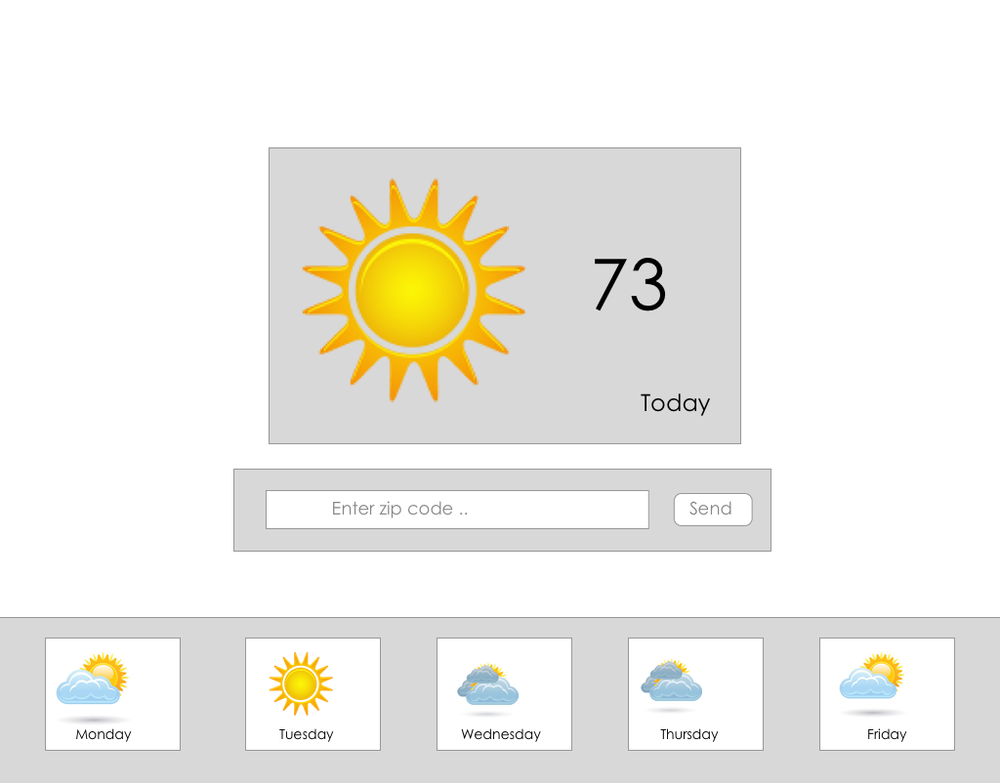

# Objective

- Create a react web app to display the weather

## Directions

- Read the documentation for https://openweathermap.org/api
- User axios to make the http request
- On page load the app should load local weather
- A user should be able to search weather by zip code

## Stretch

- Add a footer section that displays the weather for the week

